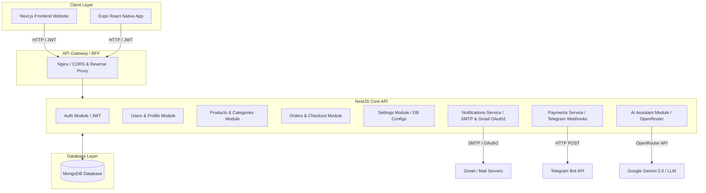

<h1 align="center">✦ Alaadin E-Commerce Platform ✦</h1>

<p align="center">
  <a href="https://nestjs.com/"></a>
  <a href="https://nextjs.org/"></a>
  <a href="https://expo.dev/"></a>
  <a href="https://www.mongodb.com/"></a>
  <a href="https://www.typescriptlang.org/"></a>
  <a href="https://www.docker.com/"></a>
</p>

A modern, highly secure, bilingual (Arabic-first & English) e-commerce system built for premium performance, smooth responsiveness, and ultimate security. The platform includes a robust **NestJS API Backend**, an interactive **Next.js Web Frontend** mimicking native mobile app experiences, and a **Cross-Platform React Native Mobile App** powered by Expo.

---

## 🌟 Core Features

### 🌍 Bilingual & Multi-Currency Engine
- **Arabic-First Design:** Fully optimized RTL (Right-to-Left) rendering, Arabic translation, and layout structure alongside high-fidelity LTR English support.
- **Dynamic Currencies:** Automatic lookup, exchange rates, and symbols for multiple regional currencies (e.g., YER, SAR, USD).

### ⚙️ Dynamic Administrative Control Center
- **Dynamic Email Routing:** Support for three states: **Standard SMTP Server**, **Google API OAuth2 (Gmail SMTP)**, or **Disabled**. Configured dynamically at runtime via database overrides.
- **Telegram Notifications:** Receives instant notifications, order details, and buyer-submitted receipts on a Telegram channel via bot integration.
- **Image Asset Management:** Advanced upload preview grids, drag-and-drop actions, cover assignment, and storage optimization inside the admin dashboard.

### 🤖 E-Commerce AI Assistant
- Integrated AI chatbot powered by **OpenRouter API** to help users discover items, track packages, and ask questions.

### 💳 Manual Payments Approval Flow
- Customers upload payment proof (receipt photo).
- Instant push triggers a Telegram message to store admins.
- Admins inspect, approve or reject payment proofs in one-click via the dashboard.

---

## 🔒 Security Architecture

The application is built to production standards using the **Principle of Least Privilege** and secure coding practices:
1. **Dynamic Secret Masking:** Sensitive credentials (SMTP passwords, Google Client secrets, Telegram Bot tokens) are hidden with `••••••••` at the API layer. Updates ignore masked values to prevent accidental credential overwrites.
2. **Strict Password Rules:** Admin changes enforce a verified old password and mandate a strong 12+ character pattern.
3. **Role-Based Access Control (RBAC):** Dynamic JWT guards shield and isolate customer operations from admin actions.
4. **Helmet & CORS Protections:** Secure HTTP headers configured to deny clickjacking and restrict API cross-origin requests.
5. **Rate Limiting:** Protects backend endpoints against brute-force attacks via built-in NestJS rate-limit throttlers.

---

## 🏗️ System Architecture



---

## 🛠️ Tech Stack & Directory Structure

```
eco/
├── backend/                  # NestJS Core Rest API
│   ├── src/
│   │   ├── modules/          # Core modules: auth, users, settings, products, payments, etc.
│   │   ├── database/         # Mongoose configuration & seed data scripts
│   │   ├── common/           # Custom auth guards, decorators, and global filters
│   │   └── main.ts           # Bootloader, static assets registration, prefix
│   └── package.json
├── frontend/                 # Next.js 16 Web Application
│   ├── src/
│   │   ├── app/[locale]/     # Bilingual directories and pages
│   │   ├── components/       # Premium layout, UI, and Chat elements
│   │   ├── contexts/         # React hooks for Auth, Cart, Theme, Currency
│   │   └── lib/              # API wrapper client & routing endpoints
│   └── package.json
├── mobile/                   # Expo React Native App
│   ├── src/
│   │   ├── screens/          # App screens (Home, Products, Checkout)
│   │   └── contexts/         # Native user state context
│   └── package.json
├── docker-compose.yml        # Multi-container local execution setup
└── docker-compose.prod.yml   # Production Docker runtime configurations
```

---

## 🚀 Getting Started

### Prerequisites
- [Node.js (v20+)](https://nodejs.org/)
- [Docker & Docker Compose](https://www.docker.com/)

### Copy Environment Variables
Create `.env` inside the root folder using `.env.example`:
```ini
# Server Configuration
API_PORT=5030
DOMAIN=shop.greatapps.online
FRONTEND_URL=http://localhost:3000

# Mongoose Database Connection
MONGODB_URI=mongodb://localhost:27017/ecommerce

# JSON Web Tokens
JWT_SECRET=your_super_secret_jwt_key
JWT_EXPIRATION=7d
JWT_REFRESH_SECRET=your_super_secret_refresh_jwt_key
JWT_REFRESH_EXPIRATION=30d

# Telegram Notification (Manual Payment Proofs)
TELEGRAM_BOT_TOKEN=
TELEGRAM_CHAT_ID=

# Gmail SMTP OAuth2 (Default Fallback Email Server)
GOOGLE_CLIENT_ID=
GOOGLE_CLIENT_SECRET=
GOOGLE_REFRESH_TOKEN=
GMAIL_USER=

# Custom SMTP (Fallback Email Server)
SMTP_HOST=smtp.gmail.com
SMTP_PORT=587
SMTP_USERNAME=
SMTP_PASSWORD=
SMTP_FROM_EMAIL=
SMTP_FROM_NAME="NwamCheap"

# OpenRouter (AI Assistant)
OPENROUTER_API_KEY=
OPENROUTER_MODEL=google/gemini-3.1-pro-preview
```

### 🐳 Running with Docker
To spin up the entire application stack including NestJS, Next.js, and MongoDB in one command:
```bash
docker-compose up --build
```

### 🧑‍💻 Manual Local Development

1. **Start MongoDB Instance** (or point `.env` MONGODB_URI to a cloud instance).
2. **Start Backend API Server**:
   ```bash
   cd backend
   npm install
   npm run start:dev
   ```
3. **Start Next.js Frontend Web Site**:
   ```bash
   cd frontend
   npm install
   npm run dev
   ```
4. **Start React Native Mobile App**:
   ```bash
   cd mobile
   npm install
   npx expo start
   ```

### 🚀 Running Next.js Frontend in Production with PM2
To keep the frontend running persistently in the background on the host:
1. Build the production assets:
   ```bash
   cd frontend
   npm run build
   ```
2. Start the process using PM2:
   ```bash
   pm2 start npm --name "alaadin-ecommerce-frontend" -- run start
   ```

---

## 📈 Database Seeding & Mock Products
The database will automatically seed with categories, default administrator roles, and premium mock product items with professional assets upon the first backend connection.
- Default Admin Account: `admin@nwamcheap.com` / Password: `password123`
- Default Customer Account: `customer@nwamcheap.com` / Password: `password123`

---

## 🎨 Premium Layout Elements
- **Responsive Web apk Grid:** Tailored flex-grids automatically optimize product tiles and dashboard items for compact mobile displays.
- **Glassmorphic Cards:** High-end CSS micro-interactions, dark mode parameters, and animated loading widgets.
- **Floating Controls:** Floating navigation headers, fixed solid footers, and a persistent translation bar.
